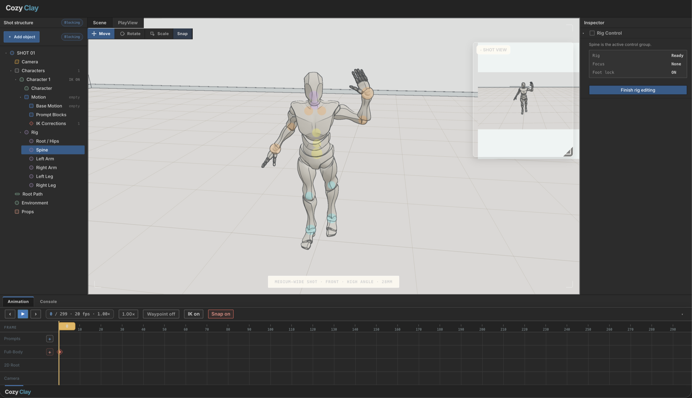
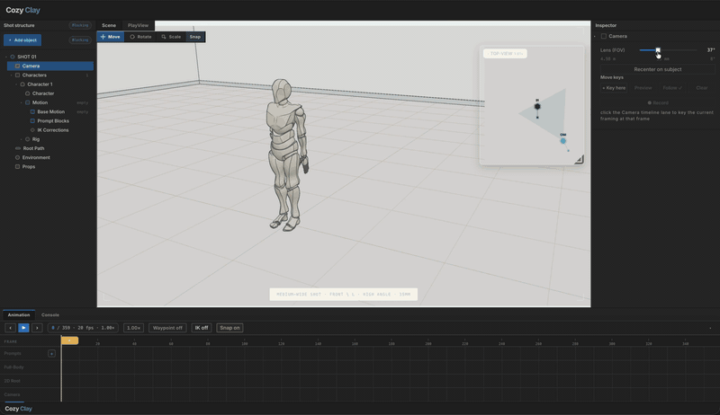

# CozyClay

CozyClay is a browser-based 3D staging studio built with Three.js and React Three Fiber. Block a scene, pose characters, sequence motion prompts on a timeline, and preview generated motion — in one local workspace that handles like the Unity Editor.

**[Open the live demo](https://cozyclay.org/app/)** — the studio itself, running in your browser. Use **Install app** in the header to keep CozyClay on your desktop or home screen; after the first load, the installed studio can open offline. It comes seeded with a pre-generated motion clip so you can scrub the timeline, drive the cameras and draw a dolly rail straight away; generating new motion needs a local ARDY machine, so that part is off.



## Demo



CozyClay can connect to [NVIDIA ARDY](https://github.com/nv-tlabs/ardy) for motion generation. ARDY is a separate third-party project owned and maintained by NVIDIA; it is not included in this repository, and CozyClay is not affiliated with or endorsed by NVIDIA.

## Requirements

- Node.js 22 or newer
- npm, or bun
- A Chromium-based browser
- Optional: an SSH-accessible NVIDIA machine running ARDY, for motion generation

## Quick start

```bash
npx cozyclay
# or
bunx cozyclay
```

That downloads the built studio and opens it at `http://127.0.0.1:5180`. There is
nothing to compile and no dependency tree to install. Useful flags:
`--port 5200`, `--no-open`, `--no-ardy`.

Motion generation is off until you point it at a machine that can run it:

```bash
CCLAY_ARDY_HOST=user@your-gpu-box npx cozyclay
```

Everything else, staging through camera work and playback, runs without it.

ARDY's text encoder normally requires a Hugging Face account, gated-model
approval, and an access token on the ARDY machine. CozyClay ships a
token-free alternative — one command provisions the same encoder stack from
public repositories, pinned by commit and SHA-256:

```bash
CCLAY_ARDY_HOST=user@your-gpu-box tools/ardy/setup-text-encoder-on-box.sh
```

See `tools/ardy/README.md` for details. This workflow is built with Meta
Llama 3; the encoder's base weights are licensed under the Meta Llama 3
Community License.

### From a clone

```bash
git clone https://github.com/HaD0Yun/CozyClay.git
cd CozyClay
npm install
npm run dev
```

Open `http://127.0.0.1:5180`. `npm run dev` starts the studio together with its local ARDY bridge; `npm run dev:ui` starts the browser UI alone, without Block Generation.

The bridge listens on loopback only. The environment variables that point it at a remote ARDY machine are documented in `tools/ardy/BRIDGE.md`.

## What you can do

**Stage a scene.** Create primitives and set pieces, then move, rotate, and scale them with a W/E/R gizmo. Grid snapping is a preference, not a law — hold `Ctrl` during a drag to invert it. A bird's-eye plan view drives 2D root waypoints for character paths.

**Edit like Unity.** Right-drag flies the camera (WASD walks, Q/E cranes), middle-drag pans, Alt+drag orbits the selection, left click selects, `F` frames. The full rule set, its source in Unity's manual, and every deliberate divergence are recorded in `docs/unity-reference.md`.

**Undo anything.** Every scene mutation goes through a single history store: one interaction — a drag, a scrub, an inspector edit — is exactly one undo entry. `Esc` cancels an in-flight drag and restores the pre-drag transform.

**Generate motion.** Pose characters and export poses, sequence multi-phase motion as Prompt Blocks on a resizable timeline, send them to ARDY, then play the result back with sparse IK correction where the generated motion needs fixing.

## Controls

| Input | Action |
| --- | --- |
| Right-drag | Look around (fly) |
| RMB + WASD | Walk while flying |
| RMB + Q/E | Crane down / up |
| Middle-drag | Pan |
| Alt + drag | Orbit the selection |
| Scroll | Dolly |
| Click | Select; empty space clears |
| W / E / R | Move / rotate / scale tool |
| Ctrl (during drag) | Invert grid snapping |
| Ctrl/Cmd+Z, Ctrl/Cmd+Shift+Z | Undo / redo |
| Esc | Cancel the in-flight drag |
| End | Drop the selection to the surface |
| Ctrl/Cmd+D | Duplicate the selection |
| F | Frame the selection |

## Validate

| Command | Covers |
| --- | --- |
| `npm run test:history` | Undo/redo store and transaction coordinator |
| `npm run test:scene-objects` | Scene-object model |
| `npm run test:hierarchy` | Hierarchy panel model |
| `npm run test:objects` | Gizmo interaction in a real browser — needs `npm run dev:ui` in another shell |
| `npm run test:theme` / `test:appearance` / `test:layout` | UI theme, appearance, layout |
| `npm run test:lifecycle` | Dev-server process lifecycle |
| `npm run test:ardy` | ARDY conversion, playback, and IK pipeline |
| `npm run build` | Production build |

Ad-hoc browser QA, while a dev server is available:

```bash
npm run qa:browser -- <qa-script>
```

## Repository hygiene

Generated motion archives, QA output, build output, logs, and local runtime artifacts are not source files and must not be committed. In particular, keep `tools/ardy/out/`, `artifacts/`, `dist/`, `.gjc/`, and `.npz` files local.

## License

GNU General Public License v3.0 or later — see `LICENSE`. Third-party projects retain their own licenses and copyright; see `THIRD_PARTY_NOTICES.md`.
