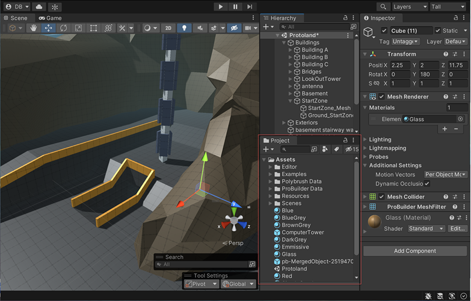
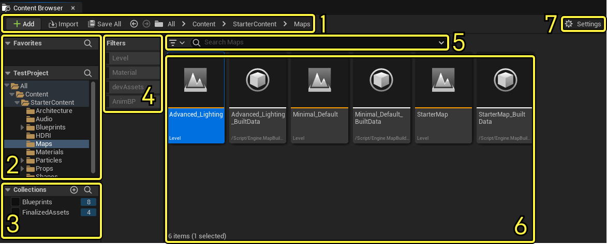
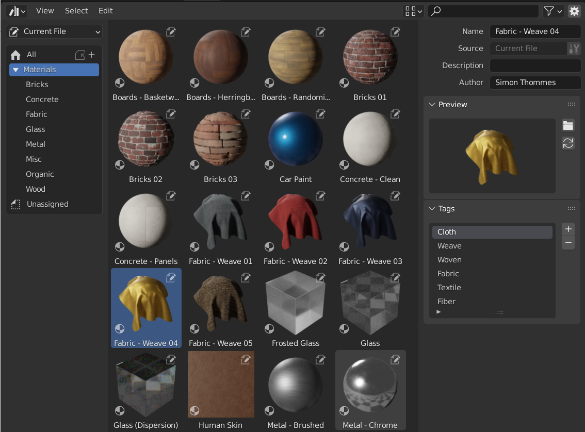
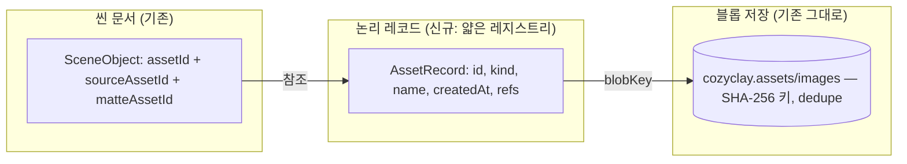

# CozyClay 에셋 시스템 재설계 노트
STATUS: complete draft — gates pending

> 리서치 기반: `.omo/ulw-research/20260820-184437/` — 팀 8인(코드베이스·Unity/Unreal·Blender·Godot·웹툴·UI/UX·스켑틱·컨트래리언) + 레인 6개, 1차 소스 95+건, 디베이트 5라운드. 코드 근거는 HEAD `b71358856` 기준.

## 1. 현황 진단

CozyClay에서 "에셋"이라는 말은 서로 배선이 전혀 다른 세 시스템을 동시에 가리킨다.

| 시스템 | 내용물 | 진입점 | 저장 위치 |
|---|---|---|---|
| Assets 탭 | 하드코딩 캐릭터 2종 (Y/X Bot) | 하단 탭 → 드래그 스폰 | `CHARACTER_MODEL_IDS` (scenes.js:31) + public/models FBX |
| 오브젝트 카탈로그 | 프리미티브 6 + 세트피스 3 | 하이어라키 "Add object" 팝오버 | `OBJECT_LIBRARY` 코드 상수 (scene-objects.js:64) |
| 이미지(컷아웃) | 임포트한 사진 + 파생 매트 | 파일 입력·드롭·붙여넣기 (App.jsx 6429-6436, 1661-1676, 997-1030) | IndexedDB `cozyclay.assets/images`, SHA-256 id |

핵심 사실:

- **임포트한 이미지는 브라우징이 불가능하다.** 임포트 순간 컷아웃 인스턴스 1개로 소비되고, 목록·썸네일·재사용·삭제 UI가 없다. 재사용 방법은 보이는 카드를 복제하는 것뿐.
- **컷아웃은 3-ID 레코드다.** `assetId`(렌더 결과) / `sourceAssetId`(원본) / `matteAssetId`(선택 마스크) — 누끼 재편집을 위한 의도적 설계 (commit e26193752, scene-objects.js:204-241).
- **GC API는 만들어져 있으나 배선이 안 됐다.** `listAssetIds`/`deleteAsset`/`unreachableAssetIds`(scene-assets.js:241-318)는 노드 테스트까지 있으나 앱 호출자가 0곳. IndexedDB는 무한 성장한다.
- **git 이력이 말하는 것:** 이미지는 컷아웃 기능의 구현 디테일로 자라났지, 운영자용 카탈로그로 설계된 적이 없다 (cbda9663d→b71358856 체인). 지금의 분열은 "작업 범위에 국한된(task-local) 의도적 설계"가 아니라 **설계되지 않은 누적**이다.

즉 문제는 셋 다 맞다: 데이터 모델(결함 3건, §3), UI(2장짜리 Assets 탭), 개념(같은 단어가 3개 시스템을 가리킴).

## 2. 레퍼런스 비교 (Unity / Unreal / Godot / Blender / 웹 툴 / AE / Figma)

7개 툴 전부에서 안정적으로 반복되는 3층 구분: **에셋**(영속 정체성을 가진 재사용 단위) / **씬 오브젝트**(현재 그래프의 살아있는 요소) / **인스턴스**(원본에 묶여 재파생 가능한 배치). 이름만 다르다.

| 툴 | 에셋 용어 | 인스턴스 용어 | 브라우저 UI 위치 | 큐레이션 모델 |
|---|---|---|---|---|
| Unity | Asset (.meta GUID) | Prefab instance | Project window (도킹 자유) | 폴더 자동 임포트 + 라벨/즐겨찾기/저장 검색 [S1,S12] |
| Unreal | Asset (.uasset) | Actor (spawn) | Content Browser / 하단 Content Drawer(자동 최소화+핀) | 폴더 + Collections(수동) + Filters(쿼리) [S2,S41] |
| Blender | Data-block + 'Mark as Asset' 메타데이터 | Object / collection instance | Asset Browser(임의 영역의 에디터) + Outliner(전체 데이터) | 옵트인 마킹, UUID 카탈로그, '작가가 곧 에셋 매니저' [S7,S50] |
| Godot | Resource (uid://) | Node / PackedScene.instantiate() | FileSystem dock (트리+그리드) | 소스 유지 + .import 레시피 커밋, 파생물 재생성 [S27,S36] |
| Maya | File reference / asset container | referenced object | Outliner + Reference Editor | 부모-자식 씬 참조, 편집은 reference node에 |
| After Effects | Footage item / Composition | Layer (소스 공유, 오버라이드 전파 없음) | **Project panel** | 폴더 정리 + .aet 템플릿 + pre-comp 중첩 |
| Figma | Component (main) | Instance (업데이트 수신 + 오버라이드) | 좌측 Assets 탭 | 로컬 vs 팀 라이브러리 발행, 명시적 업데이트 수락 [S75-77] |
| PlayCanvas/Spline/Blockbench | asset / texture 레코드 | entity / face-ref | 하단 레지스트리 / 좌측 레일 / 도킹 패널 | 참조 인지 삭제·remove-unused가 공통분모 [S68,S22,S64] |

### 참고: 엔진별 브라우저 실화면 (공식 문서 스크린샷)

| | |
|---|---|
|  Unity Project window (1열 레이아웃) |  Unreal Content Browser 7영역 |
|  Blender Asset Browser 3영역 |  Godot FileSystem dock |

전체 19장: `.omo/ulw-research/20260820-184437/assets/engine-shots/`

CozyClay에 시사하는 핵심 수렴점 5개:

1. **소스/파생 분리** — Unity(.meta+아티팩트)·Unreal(DDC)·Godot(.import) 전부: 소스는 보존, 파생물은 레시피로 재생성, 파생 상태는 출처 라벨과 함께 노출. 단 셋 다 파일시스템·팀 전제의 수렴 구현이므로 어휘만 가져온다(§4).
2. **정체성 ≠ 콘텐츠 해시** — Godot는 체크섬-as-uid를 명시적으로 거부[S29]; Unity는 GUID+fileID[S16]; 출시된 웹 에디터(Excalidraw/tldraw)도 불투명 앱 id[S87,S88]. 해시는 블롭/중복제거 키로 강등.
3. **드래그 = 인스턴스 생성** — 어느 툴에서도 에셋이 씬으로 '이동'하지 않는다. 브라우저는 정의의 표면, 씬은 인스턴스의 표면, 인스펙터는 문맥 전환[S13,S38].
4. **참조 인지 삭제** — PlayCanvas(사용처 메뉴)·Spline(remove-unused+undo)·Figma(인스턴스 영향 경고)·Blender(purge 다이얼로그) 수렴; Blockbench(확인 없는 삭제→조용한 dangling)가 반면교사[S69,S22,S77,S46,S64].
5. **배치는 규정이 아니다** — 4개 엔진·Blender 문서 어디에도 '에셋 브라우저는 하단'이라는 공식 규정·근거가 없다(4중 dead-end 확인). Unity는 도킹 자유, Unreal은 '일시적 서랍+핀'. CozyClay의 하단 탭 유지는 유효한 선택이지 모방 근거가 아니다.

**솔로 previs에 맞는 멘탈 모델**: 엔진의 임포트 파이프라인이 아니라 **After Effects의 프로젝트 패널 모델**(프로젝트 = 씬들 + 소스 참조 목록, 중첩으로 재사용)이 가장 가볍게 들어맞는다. 인스턴스 오버라이드 '전파'(Figma/prefab)는 필요가 확인되면 추가하는 full-C 영역.

(주: Maya Content Browser 패널 존재 여부는 이번 세션에서 미검증. AE 인용은 Wayback 스냅샷이 현행 표준 문서와 일치함을 확인한 것.)

## 3. 확인된 결함 3건 (P0 — 어떤 설계를 택하든 먼저 고칠 것)

세 결함 모두 독립된 두 코드 감사(팀 auditor + explore 레인)가 file:line 수준에서 교차 확인했다.

1. **복제가 lineage를 잃는다.** 복제는 `{assetId, aspect, height, name}`만 넘긴다(App.jsx:1855-1865). 매트 적용된 카드를 복제하면 원본/마스크 참조가 초기화되어, 복제본의 누끼 재편집은 '가공된 이미지'를 새 원본으로 삼는다. 재편집 설계와 정면 모순.
2. **프로젝트 내보내기가 바이트를 잃는다.** `.cclayproject` 봉투(project.js:24-57)는 참조 id만 담고 IndexedDB 바이트는 담지 않는다. 다른 브라우저/기기에서 열면 회색 placeholder(scene-asset-cache.js:48-67). 이식성은 사실상 같은 브라우저 내로 제한된다.
3. **도달성 계산이 위험하다.** `referencedAssetIds`는 `object.assetId`만 순회한다(scene-assets.js:234-240). 이대로 GC를 배선하면 sourceAssetId/matteAssetId가 가리키는 원본·마스크를 지워 재편집을 파괴한다. GC는 **id 3종의 전이적 폐쇄(transitive closure)**를 전 씬에 걸쳐 계산해야 한다.

부수 결함: 텍스처 캐시의 실패가 sticky함(재시도 API 없음, scene-asset-cache.js:53-64), import가 원본 바이트를 보존하지 않음(2048px 다운스케일 후 SHA — 원본 아카이빙 정책 미결).

## 4. 설계 옵션과 트레이드오프

| | A. UI만 손보기 | **B. C-lite (권장)** | C. 풀 콘텐츠 파이프라인 |
|---|---|---|---|
| 내용 | Assets 탭에 이미지 그리드만 추가 | 기존 스키마 위에 타입드 레지스트리 + lineage 보존 + 폐쇄 기반 도달성 + 셸프 projection | Canonical Asset / Representation / Derivative / Scene Instance 4-레이어 영속화 |
| P0 결함 3건 | 미해결 (모델은 그대로) | **해결** | 해결 (과잉으로) |
| 비용 | 1~2일 | **수일** (기존 seam 재사용) | 수주 (App.jsx 대수술 + 전면 마이그레이션) |
| 리스크 | '보이는데 여전히 깨짐' | kind 남용 (완화: 행동 표 필수) | 관측되지 않은 문제(팀 협업·다중 표현·버전링)를 위한 구조 |
| 판정 | 부족 | **채택** | 증거 나올 때까지 보류 |

- 엔진 3사(Unity `.meta`/아티팩트, Unreal DDC, Godot `.import`)가 소스/파생 분리에 수렴하는 것은 사실이나, 셋 다 "파일시스템 + 빌드 파이프라인 + 대규모 콘텐츠" 전제를 공유한다 — 수렴하는 구현이지 CozyClay 규모 적합성의 독립 증거가 아니다(스켑틱 라운드 2). 개념은 어휘로 가져오되 4-레이어 영속화는 하지 않는다.
- Excalidraw의 24시간 grace 타이머도 기각: 협업/비동기 경합이 없는 솔로 로컬 앱에는 명시적 미리보기 + undo/휴지통이 더 가벼운 수단으로 같은 안전성을 보장한다.

## 5. 권장안: C-lite 타깃 아키텍처 + 에셋 셸프 projection

> "다른 scene-first 에디터처럼 CozyClay에도 컴팩트한 재사용 표면이 필요하다. 다만 그들의 파편화된 lifecycle 구현과 달리, 그 표면을 **하나의 타입드 프로젝트 리소스 그래프, 하나의 직렬화 계약, 하나의 전이적 도달성 규칙**으로 받친다 — 콘텐츠 파이프라인 아키텍처를 조기 도입하지 않고." (디베이트 최종 문장)

'C-lite'는 임시 타협이 아니라 **관측된 워크플로에 대한 타깃 아키텍처**다.

### 5.1 데이터 모델 (두 사용자 개념 + 두 저장 레벨)

- **두 레벨, 두 필드가 아니라.** 논리 레코드(불투명 id — 빌트인은 `builtin:y-bot` 식 결정적 네임스페이스 id, 임포트는 신규 발급)와 SHA 키 블롭 저장(중복 제거는 지금처럼 공짜). 기존 `img-*` id는 블롭 키로 그대로 유효 — 마이그레이션은 별칭이 아니라 '위에 레이어 추가'다.
- **kind는 좁은 열거형 + 행동 표.** 최소: `character`(빌트인, 불변, ARDY 와이어 키 유지) / `object-def`(카탈로그 정의) / `image-source`(임포트 원본) / `cutout-render`(파생) / `matte`(파생). 각 kind에 placeable? / 직렬화? / 의존성 추적? / 셸프 노출? 4칸을 채워서 정의하고, **행동이 동일한 kind는 병합한다**. 매트 상태(ready/stale)는 영속 워크플로가 아니라 파생 UI 상태.
- **씬 노드는 인스턴스다.** 에셋은 절대 씬으로 '이동'하지 않는다. 드래그 = placement 생성. 라벨도 그렇게 쓴다("셸프에 추가"가 아니라 "샷에 추가").
- **하나의 lifecycle 계약.** 도달성 = 전 씬의 id 3종을 시드로 한 전이적 폐쇄 + lineage 에지 추적. 직렬화·GC·export가 전부 이 한 규칙을 쓴다. three.js 에디터의 실패(머티리얼은 refcount, 지오메트리는 누수, 텍스처 레지스트리는 죽은 코드)가 per-kind 규칙 분기의 말로다.

### 5.2 P0 수정 (같은 패키지, 순서 고정)

1. 복제 시 lineage 복사(`sourceAssetId`/`matteAssetId`/`matteScale` 전달) — 회귀 테스트 먼저.
2. 도달성은 id 3종 폐쇄로 교정 — 픽스처: 원본만/매트 적용/복제/공유 의존/왕복 export.
3. 프로젝트 봉투 v2: 폐쇄에 든 블롭을 임베드(현행 단일 JSON 관행 — .tldr/.excalidraw 방식)하고 v1 리더 유지.
4. 그 다음에야 'Remove unused'(미리보기 + 명시 확인 + undo/휴지통) 배선. 타이머 GC 없음.

### 5.3 UI: 셸프는 projection이다

- **하나의 Assets 패널** (하단 탭 유지 — 이 배치는 엔진들의 공식 규정이 아니라 관행적 유추임을 알고 선택): 기본 = placeable kind만의 썸네일 그리드(캐릭터 + 카탈로그 + image-source), 매트·내부 파생물은 숨김. 고급 = '저장 공간 관리/미사용' **모드**(별도 화면 아님 — 스켑틱 라운드 2 판정).
- 선택 계약: 클릭 = 선택+인스펙터(에셋 문맥), 드래그 = 인스턴스 생성(기존 `onAssetGrab` seam 재사용), 더블클릭 = 편집(이미지면 매트 에디터).
- 삭제는 참조 인지형: 사용처 수 표시 + 확인 (PlayCanvas refs 메뉴 / Spline remove-unused+undo / Blender purge 다이얼로그 / Blockbench의 '확인 없는 삭제 → 조용한 dangling' 반면교사).
- 인스펙터는 공유하되 문맥 전환(Unity 패턴): 에셋 선택 → 출처/파생 정보, 인스턴스 선택 → 변환/시간.

### 5.4 상세 UI 지침 (UI/UX 레인 확정)

**패널 전환 계약** — "선택을 따라가는 것은 내용물이지 컨테이너가 아니다" (Ableton Clip View / Godot / Blender 3사 수렴):
1. 선택으로 패널을 자동 열기/닫기/리사이즈하지 않는다. 열려 있는 패널의 내용만 바뀐다. 탭 전환은 명시적 클릭으로만.
2. 고정 높이 컨테이너 안에서 내용 교체(현행 `--timeline-height` 그대로), 전환 애니메이션은 transform만, 트리거 클릭 후 500ms 내 완료.
3. 현재 문맥 표시 2중화: 활성 탭 + 대상 이름 헤더(Blender data-context-path 패턴).
4. **핀 버튼을 처음부터 넣는다.** Godot는 하단 패널 자동 전환 때문에 결국 escape 설정 4종 + 핀을 출시했다(PR #98657, diff 확인). 자동 전환을 넣는다면 끄는 길과 고정하는 길을 함께.
5. 탭별 상태(스크롤/줌) 복원. Assets에서 돌아온 타임라인은 떠날 때 그대로.
6. 에셋 선택이 패널을 다른 곳으로 '내비게이션'시키지 않는다 — Animation/Console/Assets는 in-page 탭이므로 그 의미론을 유지.

**빈 상태와 규모** — 13개 내장 에셋이 있는 셸프는 빈 상태가 아니다. 진짜 빈 상태는 '내 이미지' 영역에 국한하고, 빈 그리드 위에 문구를 얹지 말고 그 영역을 대체한다(Carbon). 임포트 스캔 중엔 스켈레톤 — 스캔 전 "이미지 없음" 노출은 최악의 실패 모드(NN/g). 검색·트리는 보류: ~20개까지 평평한 그리드, 뷰포트를 넘기 시작하면 그룹 헤더+타입 필터, 60+에서 검색(휴리스틱, ASSUMED).

**인지 풍부함은 개수가 아니라 구조** — 소비자 행동 연구 문헌(peer-reviewed, 전이 주의 라벨): 정렬 가능한 의미 축으로 그룹하면 작은 라이브러리도 작아 보이지 않는다. 그룹 축: 인물 / 소품 / 내 이미지. 하단 패널의 가로 셸프 배치는 그 자체로 유리. 개수 배지는 달지 않는다(개수를 salient하게 만드는 역효과). '망가져 보임'을 만드는 건 희소가 아니라 무질서다.

**썸네일 파이프라인** — `createImageBitmap(blob, {resizeWidth, resizeQuality:'high'})`를 워커의 OffscreenCanvas에서(둘 다 Baseline); EXIF는 기본값으로 처리된다. 콘텐츠 해시 키로 IDB에 영속, 명시적 재생성 액션, 미참조 엔트리는 정리 대상, 캐시 미스는 조용히 재생성(브라우저 축출 대비). 배지는 읽기 전용+텍스트 라벨, 드래그 타깃 옆에서 클릭 불가. 호버 프리뷰에 과업 필수 정보 금지, 키보드 포커스 동등 지원.

## 6. 마이그레이션 단계

전부 기존 저장소 위 additive. 파괴적 단계 없음.

| 단계 | 내용 | 호환성 |
|---|---|---|
| M0 | 회귀 테스트: 복제 lineage / 도달성 픽스처 / export 왕복 | — |
| M1 | 복제 lineage 수정 (App.jsx:1855-1865) | 스키마 불변 |
| M2 | `referencedAssetIds`를 id 3종 폐쇄로 확장 (scene-assets.js:234-240) | 스키마 불변 |
| M3 | 논리 레지스트리 추가: 기동 시 전 씬 스캔으로 image-source 레코드 lazy 생성; `img-*`는 블롭 키로 유지 | additive |
| M4 | 프로젝트 봉투 v2 (블롭 임베드), v1 리더 유지 | 봉투 버저닝 |
| M5 | Assets 탭 개편: placeable 그리드 + 관리 모드 + 참조 인지 삭제 (`listAssetIds`/`getAsset`/`onAssetGrab` 재사용) | UI만 |
| 보류 | Representation 레이어, 카탈로그 UUID 트리, 타이머 GC, 원본 바이트 아카이빙 | 증거 발생 시 |

지키는 제약(감사 확정): `cozyclay.assets` v1/`images` 스토어와 `img-` 32-hex id 판독 유지; `cozyclay.scenes.v4` + v1~v3 폴백 체인 보존; 레거시 컷아웃 normalize 규칙 유지; `CHARACTER_MODEL_IDS`는 ARDY 와이어 프로토콜 키이므로 불변.

## 부록 A. 근거 소스 (발췌 — 전체는 sources-ledger.md)

코드 근거: CozyClay HEAD `b71358856` — file:line은 본문 인라인. 독립 감사 2회(팀 auditor 140 tool calls + explore 레인 63 tool calls) 교차 확인, 테스트 스위트(scene-assets/scene-objects/matte/matte-editor/scenes/project) 통과 확인.

| 축 | 대표 1차 소스 |
|---|---|
| Unity | docs.unity3d.com — ProjectView, Searching, AssetMetadata(.meta), asset-database-contents, assets-direct-reference(GUID+fileID), Prefabs, UsingTheInspector [S1,S12-21] |
| Unreal | dev.epicgames.com — content-browser-interface, asset-registry, derived-data-cache 5.3, filters-and-collections, unreal-editor-interface(Content Drawer), working-with-assets [S2-5,S25-26,S40-44] |
| Godot | docs.godotengine.org — resources, ResourceUID(체크섬-as-uid 명시적 거부), import_process; godot@7a3904e2 소스 permalink (filesystem_dock.cpp, resource_uid.cpp, editor_file_system.cpp) [S27-S39] |
| Blender | docs/developer/code.blender.org — data_blocks(ID.us/Fake User), asset_libraries(Mark as Asset=메타데이터), asset_catalogs(UUID 카탈로그), 2021 workshop outcomes, Outliner 인터페이스 [S6-10,S45-56] |
| 웹 툴 | three.js@09860b8f·blockbench@47e633e4 소스; PlayCanvas·Spline·Figma 공식 문서 [S22-24,S59-78] |
| 스토리지 | MDN/web.dev(쿼터·축출), w3c/IndexedDB#454 + Chromium indexed_db 문서(블롭 미회수), excalidraw@e160ff7 LocalData.ts(mark-and-sweep), tldraw@5181649 [S79-S95] |
| 시각 증거 | 엔진 4종 공식 문서 스크린샷 19장 — `.omo/ulw-research/20260820-184437/assets/engine-shots/` |

## 부록 B. 기각/보류된 대안 (디베이트 기록)

| 대안 | 출처 증거 | 기각/보류 사유 (라운드) |
|---|---|---|
| 매트 = 순수 캐시(DDC 유추, 전부 재생성 가능 취급) | Unreal DDC [S4] | 3-ID 설계가 매트를 편집 가능 정체성에 포함시킴; '승격 가능한 파생물'로 약화 (R1) |
| 모든 항목 durable + 셸프 = 메타데이터 (Blender 전면 이식) | Blender [S7,S10] | 인스턴스/드래프트/카탈로그 정의는 에셋이 아님; 사용자 소유 소스만 durable로 축소 (R1) |
| 풀 reachability 그래프 + pin + orphan 전용 UI | Blender [S6] | 수십 장 규모에 불균형; 명시적 sweep + 미리보기 + undo로 축소 (R1→R2) |
| 4-레이어 영속화 (Canonical/Representation/Derivative/Instance) | 엔진 3사 수렴 | 셋 다 파일시스템·빌드 전제 공유 = 수렴 구현이지 규모 적합성 증거 아님; 어휘로만 채택 (R2) |
| UUID+해시 2필드 전면 도입 | Godot uid [S29-30] | '2레벨'(논리 레코드 + SHA 블롭 키)로 재구성; 기존 dedupe 보존 (R2) |
| 큐레이션 셸프와 전체 데이터 관리의 별도 표면 | Blender Outliner/브라우저 [S46] | <50 에셋 규모에서 항해 비용 > 이득; 한 패널 + 관리 모드 (R2) |
| Excalidraw식 24h grace 타이머 GC | excalidraw [S87] | 협업/비동기 경합 없는 솔로 앱엔 불필요한 기계; 명시적 확인+undo로 대체 (R2) |
| 카탈로그 UUID 트리 | Blender [S50] | 단일 사용자·평평한 세트엔 태그/카테고리면 충분 — 보류 (Blender 자체 counter) |
| '작업 범위에 국한된 분산' 프레이밍 (현상 유지) | contrarian 초기 감사 | git 이력이 '설계되지 않은 누적'임을 입증 [C-CB9]; 기각 (R2b) |

